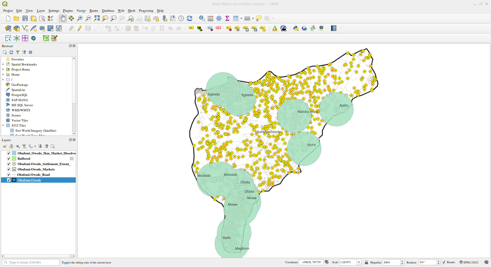

# Rural Market Accessibility Analysis

Which settlements in Obafemi Owode Local Government Area, Ogun State, are located more than 5 kilometres from a recognized marketplace?

Built over twelve months with GeoDev Lab Africa, Cohort One.
See [project-brief.md](project-brief.md) for the full brief.
